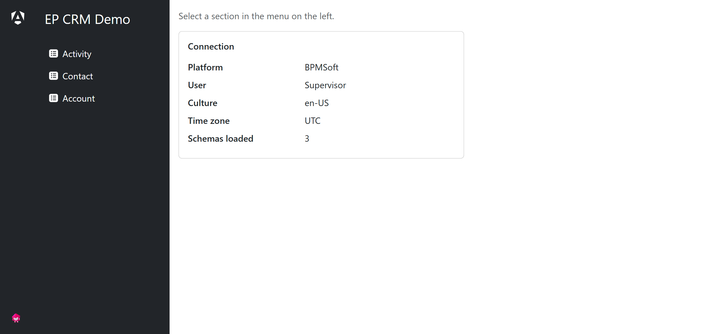
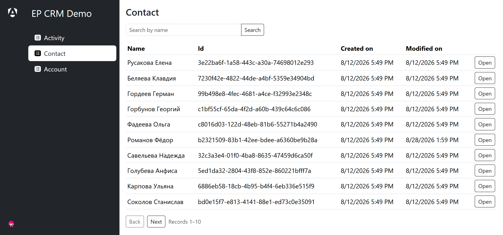

# EP CRM SDK

[](https://github.com/deidron/ep-crm-sdk/actions/workflows/ci.yml)
[](LICENSE)

Angular workspace for the Creatio/BPMSoft platforms: two libraries that talk to the
platform's DataService, a demo application that shows them at work, and a diagnostic bundle
that verifies them on a live platform page.

| project                                              | contents                                                                                                                   |
| ---------------------------------------------------- | -------------------------------------------------------------------------------------------------------------------------- |
| [`@ep-crm/core`](projects/ep-crm/core/README.md)     | Plain TypeScript: query building, entity/response parsing, platform service contracts.                                     |
| [`@ep-crm/devkit`](projects/ep-crm/devkit/README.md) | Angular bindings for `@ep-crm/core`: injectable `QueryExecutor`, session/user context, standalone/embedded mode detection. |
| `ep-crm-demo` (`src/`)                               | Demo application: sign-in, dashboard with entity-schema browsing, user profile, i18n, loading/error UI.                    |
| [`ep-crm-probe`](probe/README.md)                    | Interface-less diagnostic bundle that runs `@ep-crm/core`/`@ep-crm/devkit` inside a Creatio/BPMSoft page.                  |

- [Screens](#screens)
- [Platforms](#platforms)
- [Quick start](#quick-start)
- [Project layout](#project-layout)
- [Scripts](#scripts)
- [Build configurations](#build-configurations)
- [Service routes](#service-routes)
- [Tests and the quality gate](#tests-and-the-quality-gate)
- [Docker](#docker)
- [Deployment](#deployment)
- [Diagnostics on a live platform](#diagnostics-on-a-live-platform)
- [Internationalization](#internationalization)
- [Contributing](#contributing)
- [License](#license)

## Screens

The demo application, signed in against a stand and browsing an entity schema.

| Sign-in                             | Dashboard                            |
| ----------------------------------- | ------------------------------------ |
|  |  |

A section: the platform's display column, paging and search over `Contact`.



## Platforms

Creatio and BPMSoft share one HTTP protocol; the platform page exposes a different global
variable name (`Terrasoft` for Creatio, `BPMSoft` for BPMSoft). The platform name for a
standalone build is set in `src/environments`; in embedded mode it is detected from the
global — see `@ep-crm/devkit`, ["Two runtime modes"](projects/ep-crm/devkit/README.md#two-runtime-modes).

The demo application runs standalone, against the dev proxy, and is not embedded into a
platform page. Sign-in is not handled by the app: the session is a platform cookie, and
`UserContextService.userInfo()` is the authorization flag — see
["Session flag"](projects/ep-crm/devkit/README.md#session-flag).

## Quick start

Prerequisites:

| tool | version                                              |
| ---- | ---------------------------------------------------- |
| Node | `^22.22.3 \|\| ^24.15.0 \|\| >=26.0.0` (CI: 24.20.0) |
| pnpm | `11.25.0`, pinned in `packageManager`                |
| CRM  | a reachable Creatio or BPMSoft stand                 |

```bash
corepack enable          # pnpm from the packageManager field, no global install
pnpm install             # also installs the Husky hooks
cp .env.example .env     # then set CRM_BACKEND to your stand
pnpm start               # http://localhost:4200/, reload on source changes
```

`.env` configures the dev proxy only — it is read by `proxy.config.mjs` at serve time and
never compiled into the bundle:

| variable        | meaning                                                               |
| --------------- | --------------------------------------------------------------------- |
| `CRM_BACKEND`   | the stand `/crm/*` is forwarded to. Default `http://localhost:80`.    |
| `CRM_WORKSPACE` | workspace prefix for routes with scope `workspace`. Empty by default. |

Without `.env` the proxy warns and falls back to `http://localhost:80`. An environment
variable of the same name overrides the file.

The distribution of the stand must match `platformName` in
`src/environments/environment.development.ts` — that one _is_ compiled into the bundle and
does not follow the proxy address. A Creatio stand addressed with the BPMSoft name (or the
other way round) sends batch queries with a foreign `__type` contract.

Libraries do not need to be built to serve the app: `tsconfig.json` maps `@ep-crm/core` and
`@ep-crm/devkit` to their sources first. Building them is required for their own package
builds and for the devkit test suite — see [Tests](#tests-and-the-quality-gate).

## Project layout

```
projects/ep-crm/core     @ep-crm/core     — protocol, queries, parsing, date patterns (no framework)
projects/ep-crm/devkit   @ep-crm/devkit   — Angular services over core, culture-aware date rendering
probe                    ep-crm-probe     — diagnostic bundle for a live platform page
src                      ep-crm-demo      — the demo application
  app/authorization      sign-in, login guard, route matching
  app/dashboard          shell with the sidebar
  app/entity-schema      entity-schema browsing: section, page, resolver
  app/user-profile       profile page and its store
  app/config             service routes, proxy URL provider, platform interceptor
  app/errors             error pages
  app/loading            navigation and request loading indicators
  app/testing            shared test helpers (.testing.ts)
  environments           production / development / bpmsoft / terrasoft
  locale                 en-US.json, ru-RU.json
server                   nginx.conf, web.config, sync-routes.mjs
```

## Scripts

Run with `pnpm <script>`.

| script                                   | does                                                                |
| ---------------------------------------- | ------------------------------------------------------------------- |
| `start`                                  | dev server on `http://localhost:4200/` with the proxy               |
| `build`                                  | build the demo application into `dist/`                             |
| `watch`                                  | development build, rebuilt on change                                |
| `prod` / `prod:iis`                      | production build; `:iis` also emits `web.config` next to the bundle |
| `build:bpmsoft` / `build:terrasoft`      | development build with the platform name compiled in                |
| `build:core` / `build:devkit`            | build one library into `dist/ep-crm/*`                              |
| `build:libs`                             | both libraries, in the required order                               |
| `build:probe`                            | probe: Angular build plus the esbuild IIFE bundle                   |
| `test`                                   | the full gate — see [below](#tests-and-the-quality-gate)            |
| `test:core` / `test:devkit` / `test:app` | one suite in watch mode                                             |
| `lint` / `lint:fix`                      | ESLint over everything                                              |
| `format` / `format:check`                | Prettier write / verify                                             |
| `routes:sync` / `routes:check`           | regenerate / verify the server route maps                           |

## Build configurations

Configurations of the `ep-crm-demo` build target, each a file replacement over
`src/environments/environment.ts`:

| configuration | environment file             | `platformName` | use                                        |
| ------------- | ---------------------------- | -------------- | ------------------------------------------ |
| `production`  | `environment.ts`             | `null`         | default; budgets and output hashing        |
| `development` | `environment.development.ts` | `null`         | source maps, no optimization; `pnpm start` |
| `bpmsoft`     | `environment.bpmsoft.ts`     | `BPMSoft`      | a BPMSoft stand, name compiled in          |
| `terrasoft`   | `environment.terrasoft.ts`   | `Terrasoft`    | a Creatio stand, name compiled in          |
| `iis`         | —                            | —              | assets only: copies `server/web.config`    |

`bpmsoft`/`terrasoft` and `iis` are additive, applied on top of another configuration:

```bash
ng build --configuration development,bpmsoft   # = pnpm build:bpmsoft
ng build --configuration production,iis        # = pnpm prod:iis
```

`platformName: null` means the name is not pinned at build time: standalone it comes from
the application's own configuration, embedded it is detected from the platform global.

## Service routes

`src/app/config/service-routes.json` is the single list of platform services. The dev proxy
rewrites, `server/nginx.conf`, and `server/web.config` are generated from it. After changing
the JSON:

```bash
pnpm routes:sync
```

`pnpm test` fails if the generated maps are out of sync.

The workspace prefix is in none of the generated maps: it is a property of the stand — an
application on .NET Core answers without one, an application on .NET Framework answers under
a numbered workspace — and only the services with scope `workspace` ever get it. The dev
proxy reads it from `CRM_WORKSPACE` in `.env`; nginx substitutes the same variable at
container start; IIS has no substitution of its own and keeps it in the `Workspace`
rewriteMap of `server/web.config`, one commented-out line next to the backend address. Empty
everywhere by default.

What to put there is reported by the platform itself: open a platform page and look at
`workspaceBaseUrl` in its global — an address carrying a number (`http://localhost:80/0`)
means `/0`, an address carrying none means leave it empty.

## Tests and the quality gate

```bash
pnpm test
```

Runs, in order, failing on the cheapest check first: `routes:check`, `prettier --check`,
`ng build @ep-crm/core`, `eslint .`, then the `@ep-crm/core`, `@ep-crm/devkit` and
`ep-crm-demo` suites. This is exactly what CI runs, so a green `pnpm test` locally is a
green pull request.

Single suites in watch mode:

```bash
pnpm test:core
pnpm test:devkit   # builds @ep-crm/core first — the suite resolves it from dist/
pnpm test:app
```

Runner: [Vitest](https://vitest.dev/) via `@angular/build:unit-test`. No e2e framework is
configured.

## Docker

The image builds the application and serves it through nginx, which also proxies `/crm/*` to
the stand:

```bash
docker build -t ep-crm-demo .
```

```bash
docker run --rm -p 8080:80 -e CRM_BACKEND=host.docker.internal:80 -e CRM_WORKSPACE= ep-crm-demo
```

`CRM_BACKEND` here is a host, without a scheme — it becomes an nginx `upstream`. Both
variables are substituted into `server/nginx.conf` at container start.

## Deployment

**nginx** — serve `dist/ep-crm-demo/browser` and take `server/nginx.conf` as the site
config; it holds the SPA fallback, cache headers and the `/crm/*` proxy.

**IIS** — build with `pnpm prod:iis`: `server/web.config` is copied next to the bundle, and
its URL Rewrite rules do what the proxy does in development. Before publishing, set the two
rewriteMaps by hand — `Backend` (the stand address) and, if the stand needs one, `Workspace`
(the prefix, a commented-out line). IIS has no environment substitution of its own.

Both configs are generated from the service routes; regenerate them with `pnpm routes:sync`
rather than editing the route maps inside.

## Diagnostics on a live platform

The demo application is standalone and never exercises the embedded path. The
[probe bundle](probe/README.md) does: it raises its own Angular injector inside a
Creatio/BPMSoft page and checks the platform global, the shape of `workspaceBaseUrl`,
`workspace` address resolution, the XSRF header, and real `SelectQuery`/`BatchQuery` calls.
Read-only — every request is a `SelectQuery` over `Contact`.

```bash
pnpm build:probe
```

## Internationalization

[`@ngx-translate/core`](https://github.com/ngx-translate/core) with translations in
`src/locale` (`en-US.json`, `ru-RU.json`), copied into `locale/` of the bundle and fetched
by `TranslateHttpLoader`. A new language is a new file there, its culture in
`supportedCultures`, and its locale data registered in `registerCultureData()` — all three
in `src/app/app.config.ts`.

That last step is not optional. Date patterns come from the culture of the platform user,
and one that spells a month or a day out (`MMMM`, `dddd`) makes `formatDate` reach for
locale data that Angular ships for `en-US` alone; without `registerLocaleData` it throws
rather than falling back. `CultureDateService` formats in the user culture when its data is
registered and in `en-US` when it is not, so a stand reporting a culture the application
does not carry degrades instead of breaking.

The interface culture is the platform one while a session is open
(`UserContextService.currentCulture()`), otherwise the first browser language that matches
a supported culture, falling back to `ru-RU`.

## Contributing

Branches, commits, pull requests, linting and the file naming conventions are in
[CONTRIBUTING.md](CONTRIBUTING.md). In short: conventional commits, `feat/`-style branch
names, squash-only merges, and `pnpm test` green before you push.

## License

[MIT](LICENSE).

---

Generated with [Angular CLI](https://github.com/angular/angular-cli) 22.1.5 —
[command reference](https://angular.dev/tools/cli).
